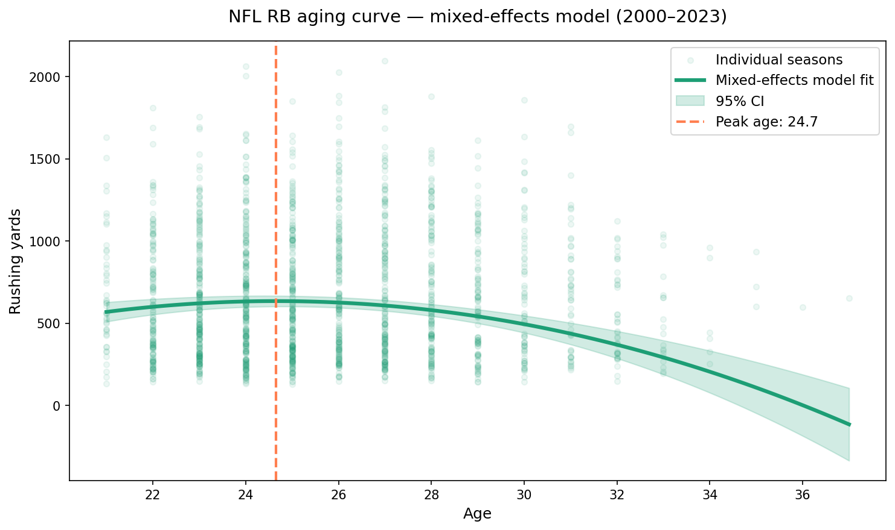

# NFL Running Back Aging Curves

An end-to-end data science project analyzing how NFL running back performance
changes with age, using mixed-effects statistical modeling on 24 seasons of data.

## Key Finding

**NFL running backs peak at age 24.7**, predicting ~636 rushing yards at peak performance.
The position declines sharply after age 28, with most players unable to sustain
qualified seasons past 32. This was identified using a linear mixed-effects model
that accounts for survivorship bias — a critical limitation of naive averaging approaches.



---

## Project Overview

This project demonstrates a full data science pipeline:

- **Data ingestion** — pulled 24 seasons of NFL stats (2000–2023) via `nfl_data_py`
- **SQL database** — normalized SQLite schema with players and season_stats tables
- **Feature engineering** — age calculation, filtering, and centering for modeling
- **Statistical modeling** — linear mixed-effects model (LME) with random intercepts per player
- **Interactive dashboard** — Streamlit app with metric selector and player highlighting

---

## Why Mixed-Effects Modeling?

Naive averaging by age produces misleading results due to **survivorship bias** —
the only players still active at age 34 are elite outliers, artificially inflating
average performance at older ages. A simple mean suggested peak performance at age 35,
which is clearly wrong.

Mixed-effects modeling solves this by:
- Fitting each player's individual trajectory via random intercepts
- Estimating the population-level curve from fixed effects
- Correctly expressing uncertainty at ages with thin sample sizes

This is the same longitudinal modeling framework used in clinical trials and
epidemiological cohort studies.

---

## Model Specification
```
rushing_yards ~ age_c + age_c² + (1 | player_id)
```

- **Fixed effects:** age (centered) + age² — captures the quadratic rise-and-fall curve
- **Random effect:** player intercept — accounts for baseline talent differences
- **Estimation:** REML (Restricted Maximum Likelihood)
- **Peak age formula:** derived analytically as `-b1 / (2 * b2)` from quadratic coefficients

### Results

| Term | Coefficient | p-value |
|------|------------|---------|
| Intercept | 629.5 | < 0.001 |
| Age (linear) | -11.0 | 0.002 |
| Age (squared) | -4.9 | < 0.001 |

**Peak age: 24.7 years | Predicted peak: 636 rushing yards**

---

## Data

- **Source:** `nfl_data_py` — NFL seasonal stats and player metadata
- **Seasons:** 2000–2023
- **Filter:** Running backs with 50+ carries in a season
- **Final sample:** 447 unique players, 1,613 player-seasons

---

## Project Structure
```
nfl-aging-curves/
├── data/
│   └── raw/                  ← raw CSV from ingestion script
├── db/
│   ├── schema.sql            ← database schema definition
│   ├── load_db.py            ← loads CSV into SQLite
│   └── nfl_aging.db          ← SQLite database
├── scraper/
│   └── nfl_scraper.py        ← data ingestion script
├── notebooks/
│   ├── 01_eda.ipynb          ← exploratory analysis + survivorship bias
│   └── 02_modeling.ipynb     ← mixed-effects model + aging curve
├── app/
│   └── streamlit_app.py      ← interactive dashboard
└── requirements.txt
```

---

## How to Run

**1. Clone the repository**
```bash
git clone https://github.com/kennethho193/nfl-aging-curve.git
cd nfl-aging-curve
```

**2. Create and activate conda environment**
```bash
conda create -n nfl-aging python=3.11
conda activate nfl-aging
```

**3. Install dependencies**
```bash
pip install -r requirements.txt
```

**4. Generate requirements.txt (if needed)**
```bash
pip freeze > requirements.txt
```

**5. Run the data pipeline**
```bash
python scraper/nfl_scraper.py
python db/load_db.py
```

**6. Launch the dashboard**
```bash
python -m streamlit run app/streamlit_app.py
```

---

## Limitations

- Age is calculated as season year minus birth year — a slight simplification
  that does not account for exact birth date within the season
- The quadratic model predicts negative rushing yards past age 35, which is a
  known extrapolation artifact rather than a real prediction
- Analysis is limited to running backs — WR and QB aging curves would require
  separate models and different performance metrics

---

## Tools & Libraries

Python, SQL, pandas, numpy, statsmodels, matplotlib, seaborn, streamlit,
nfl_data_py, SQLite, Git

---

## Author

Kenneth Ho